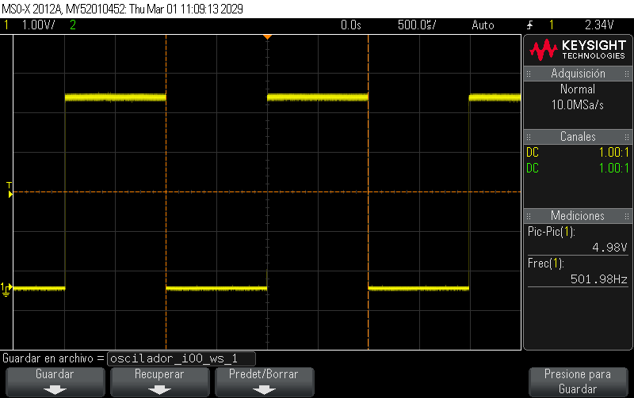
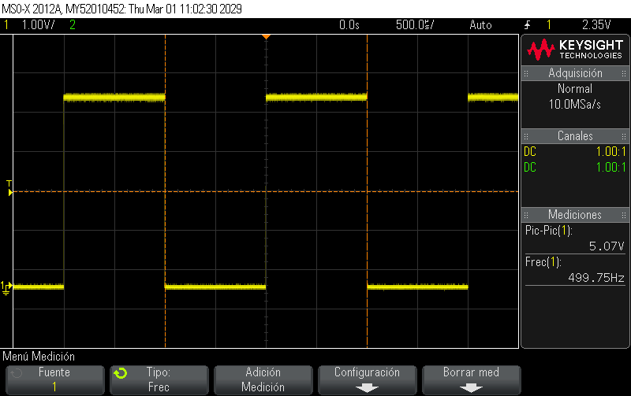
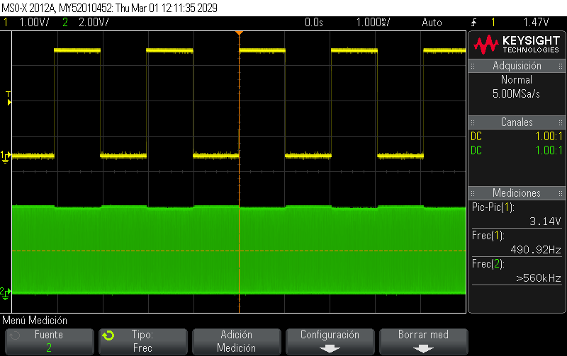
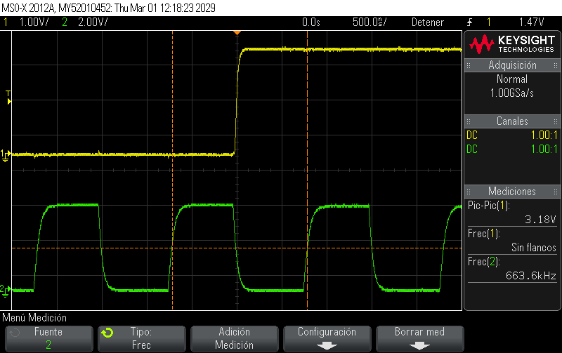

# Lab02 - Caracterización de osciladores (externo vs. interno)

## 1. Integrantes

* [Sebastian Suarez Garavito](https://github.com/sebastianavas1701-stack)
* [Sebastian Buitrago Oliveros](https://github.com/SebastianBuitrago-16)
* [Samuel Esteban Jaime Gutierrez](https://github.com/Samueljgest)

## 2. Documentación

### 2.1 Descripción del laboratorio
En este laboratorio se estudiaron diferentes tipos de osciladores en un microcontrolador, utilizando el entorno de desarrollo MPLAB X IDE y programación en lenguaje C. El objetivo fue comprender cómo la nte de reloj influye en la velocidad de ejecución del sistema.

Se realizaron tres ensambles diferentes: uno utilizando el oscilador interno del microcontrolador, otro con un oscilador externo mediante un cristal de cuarzo, y un tercero usando un oscilador RC (resistencia–capacitor). En cada caso se configuró la frecuencia solicitada y se implementó un programa para generar el parpadeo de un LED, permitiendo observar visualmente el funcionamiento del reloj del sistema.

Con estos montajes se pudo comparar el comportamiento y la estabilidad de cada tipo de oscilador, evidenciando las diferencias entre el oscilador interno, el cristal de cuarzo y el circuito RC.
### 2.2 Explicación del código implementado

### 2.3 Análisis y comparación

#### Tabla 1: Medición en frío

| Modo de oscilador | Freq. teórica Fosc | RA6 medible (CLKO)? | Freq. medida RA6 (Hz) | Freq. teórica RC0 (Hz)| Freq. medida RA7 (Hz) | Error RA7 (%) |  
|------------------|------------------|---------------------|---------------|---------------------|---------------|---------------|
| INTOSC (interno) | 16,000,000       | Sí                 |       501.98              |                500                |       Valores variados        |        -----       | |
| HS (cristal externo 16 MHz) | 16,000,000 | No |     NA      |               500                 |      499.75         |          0,05%     |
| RC externo       | ~16,000,000*     | No                                    |       N/A        | 500                 |      490.92         |      1,81%         | |

#### Tabla 2: Medición con calor

| Modo de oscilador | Freq. teórica Fosc | RA6 medible (CLKO)? | Freq. medida RA6 (Hz) | Freq. teórica RC0 (Hz)| Freq. medida RA7 (Hz) | Error RA7 (%) |  
|------------------|------------------|---------------------|---------------|-------------------|---------------|---------------|
| INTOSC (interno) | 16,000,000       | Sí                 |         501.93      |                .00                 |    Valores variados |   -----
 HS (cristal externo 16 MHz) | 16,000,000 | No |     NA      |               500                 |       498.58 |          0,28%
| RC externo       | ~16,000,000*     | NO                                  |       N/A        | 500                 |       489.95 |       2,01%| |

#### Tabla 3: Deriva

| Modo de oscilador |RC0 deriva (Hz) |
|------------------|--------------------|
| INTOSC (interno) |                    |                
| HS (cristal externo 16 MHz) |                |                |
| RC externo       |                 |                

<!-- Agregar tablas para valores usando PLL -->

<!-- Complemente con análisis de lo registrado en tablas -->

## 2.4 Diagramas

## 2.5 Formas de onda

### INTOSC (interno) 
Al realizar la medición con el osciloscopio se observó que la señal generada presenta una forma de onda cuadrada. Este tipo de señal se caracteriza por alternar periódicamente entre un nivel lógico alto y un nivel lógico bajo, manteniendo transiciones rápidas entre ambos estados.

La forma de onda cuadrada es típica en señales digitales generadas por microcontroladores, ya que representan directamente los estados binarios del sistema (1 y 0). En este caso, el oscilador interno del microcontrolador genera una señal de reloj estable que controla la ejecución de las instrucciones, lo que se refleja en la señal cuadrada observada durante la medición.

Esta señal permitió verificar el correcto funcionamiento del oscilador interno y evidenciar la frecuencia configurada durante el desarrollo del laboratorio.

### HS

Durante la medición con el osciloscopio en el montaje que utiliza cristal de cuarzo, la señal observada presentó una forma de onda cuadrada. Esta señal alterna periódicamente entre un nivel alto y un nivel bajo, lo cual es característico de las señales digitales generadas por el microcontrolador.

Aunque el cristal de cuarzo genera internamente una oscilación de tipo sinusoidal, el circuito interno del microcontrolador acondiciona esta señal y la convierte en una señal digital utilizada como reloj del sistema. Por esta razón, al medir la señal en el punto de salida utilizado para la prueba, se observa una onda cuadrada en lugar de una señal sinusoidal.

Esto permitió comprobar el correcto funcionamiento del oscilador externo con cristal y la generación estable de la señal de reloj durante el desarrollo del laboratorio.

## RC

En el montaje con oscilador RC (resistencia–capacitor) se realizaron mediciones con el osciloscopio tanto en la salida del microcontrolador como en el pin OSC1, con el fin de observar el comportamiento de la señal de reloj.

En la salida del microcontrolador se observó una forma de onda cuadrada, característica de las señales digitales, ya que el microcontrolador utiliza esta señal como referencia para la ejecución de sus instrucciones.

Por otro lado, al medir directamente en el pin OSC1, se pudo observar la señal generada por el circuito RC, la cual presenta variaciones periódicas producto de la carga y descarga del capacitor a través de la resistencia. Esta señal corresponde al proceso mediante el cual se genera el reloj del sistema.

Estas mediciones permitieron verificar el funcionamiento del oscilador RC y analizar su comportamiento en comparación con los otros tipos de osciladores utilizados en el laboratorio.

## 3. Evidencias de implementación

## 4. Preguntas

* ¿En qué modo se obtuvo la medición más cercana a la frecuencia teórica?

R: La medición más cercana a la frecuencia teórica de 500 Hz se obtuvo utilizando el oscilador externo con cristal de cuarzo, con una frecuencia medida de 499.75 Hz. Este valor presenta la menor diferencia respecto al valor teórico en comparación con el oscilador interno (501.98 Hz) y el oscilador RC (490.92 Hz). Esto se debe a que los cristales de cuarzo proporcionan una mayor estabilidad y precisión en la generación de la señal de reloj, mientras que los osciladores internos y RC suelen presentar mayores variaciones en la frecuencia.

* ¿Fue posible evidenciar el fenómeno de deriva? ¿Qué factores podrían explicar la variación de frecuencia al calentar el PIC?

* ¿Cuál es más preciso en cuanto a frecuencia teórica vs. medida?

R: La mayor precisión entre la frecuencia teórica y la frecuencia medida se obtuvo utilizando el oscilador externo con cristal de cuarzo. En este caso se midió una frecuencia de 499.75 Hz, la cual presenta la menor diferencia respecto al valor teórico de 500 Hz.

En comparación, el oscilador interno presentó una frecuencia de 501.98 Hz, mientras que el oscilador RC obtuvo 490.92 Hz, mostrando una desviación mayor respecto al valor esperado. Esto ocurre porque los cristales de cuarzo tienen una mayor estabilidad y precisión en la generación del reloj, mientras que los osciladores internos y los circuitos RC pueden verse más afectados por variaciones de temperatura, componentes y tolerancias eléctricas.

* Explique cómo usar RC0 para estimar la frecuencia del oscilador cuando RA6 no está disponible.

R: Cuando RA6 no está disponible, se puede usar RC0 para estimar la frecuencia del oscilador configurándolo como salida digital y haciendo que cambie continuamente entre estado alto y bajo en el programa. Esto genera una onda cuadrada en el pin.

Luego, se mide esta señal con un osciloscopio para obtener su frecuencia. Como los retardos del programa dependen de la frecuencia del oscilador del microcontrolador, la señal observada en RC0 permite estimar la frecuencia real del sistema.

* Si se quisiera duplicar la frecuencia del PIC usando PLL, ¿en qué modos se podría aplicar?

R: Si se quisiera duplicar la frecuencia del PIC usando PLL, se podría aplicar principalmente cuando el microcontrolador está trabajando con osciladores de alta velocidad, como:

* Modo HS (High Speed) con cristal de cuarzo

* Modo INTOSC (oscilador interno) en los microcontroladores que permiten activar el PLL interno.

En estos modos el PLL (Phase Locked Loop) permite multiplicar la frecuencia del oscilador base, aumentando así la frecuencia de operación del microcontrolador. Por ejemplo, una frecuencia base puede duplicarse para obtener una frecuencia mayor de funcionamiento del sistema.

* Enliste ventajas y desventajas de cada modo.

## 5. Referencias